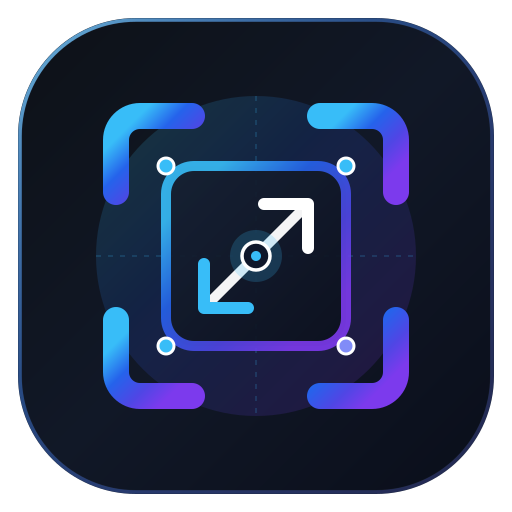

# CropScale Studio 🎨📐

> **Trình Cắt (Crop), Co Giãn (Scale) & Đổi Kích Thước (Resize) Ảnh Hàng Loạt Đa Năng Cho Mọi Ngành Nghề**



**CropScale Studio** là công cụ xử lý ảnh chuyên nghiệp hoạt động trực tiếp trên trình duyệt (100% Client-Side, chạy offline, bảo mật tuyệt đối). Ứng dụng giải quyết triệt để vấn đề méo ảnh, vỡ hình khi đưa ảnh vào các khung chuẩn cho Thương mại điện tử (Shopee, TikTok Shop, Lazada), Mạng xã hội (Facebook, Instagram, TikTok), Catalog nội thất, quảng cáo và vách CNC.

---

## ✨ Tính Năng Nổi Bật

- 🎯 **Fixed Frame Artboard (Khung Cố Định Chuẩn Xác):**
  - Khung xuất luôn cố định ở trung tâm với kích thước pixel chính xác (ví dụ: `140×140`, `240×240`, `800×800`, `1080×1080`...).
  - Lớp ảnh nằm phía sau được di chuyển tự do bằng chuột, phóng to/thu nhỏ (Zoom), xoay góc, lật ngang/dọc mà không làm méo hình.
- 📋 **Dán Ảnh Trực Tiếp Từ Clipboard (`Ctrl + V`):**
  - Dán ngay lập tức ảnh chụp màn hình hoặc ảnh copy từ Paint, Photoshop, Zalo vào app mà không cần lưu file trung gian.
- ⚡ **Sao Chép Nhanh Vào Clipboard:**
  - Nút **Sao Chép Ảnh** (màu xanh lá) cho phép lưu thẳng ảnh đã crop chuẩn pixel vào bộ nhớ tạm để dán sang các phần mềm khác ngay lập tức.
- 🤖 **Auto Center Content (Tự Động Nhận Diện & Căn Giữa Chủ Thể):**
  - Quét điểm ảnh, tự động loại bỏ nền trắng/xám thừa, tìm vị trí sản phẩm/vật thể thực tế và căn giữa vào khung hình kèm lề an toàn (Padding).
- 📦 **Xuất Ảnh & File Nén ZIP Hàng Loạt (Batch Export):**
  - Xử lý hàng chục hoặc hàng trăm ảnh cùng lúc với chất lượng cao nhất.
  - Tùy chọn đặt tên linh hoạt: Giữ nguyên tên gốc, thêm Tiền tố (Prefix), Hậu tố (Suffix) hoặc Đánh số thứ tự tăng dần.
- 🎛️ **Thư Viện Presets Đa Ngành Tích Hợp Sẵn:**
  - **E-Commerce:** Shopee / TikTok Shop / Lazada (`800 × 800`), Web Product (`500 × 500`).
  - **Mạng xã hội:** Instagram / Facebook Post (`1080 × 1080`), Story / Reel / Shorts (`1080 × 1920`), Web Banner (`1200 × 630`).
  - **Thumbnail & Icon:** `140 × 140`, `240 × 240`.
  - **Catalog & Thời trang:** Khung dọc 3:4 (`600 × 800`), Khung ngang 4:3 (`800 × 600`).
  - **Tùy chỉnh:** Nhập bất kỳ kích thước pixel tự do nào.
- 💾 **Lưu & Mở Dự Án (.cropscaleproject):**
  - Lưu lại toàn bộ trạng thái căn chỉnh, tọa độ và thiết lập để tiếp tục làm việc bất kỳ lúc nào.
- 🛡️ **100% Client-Side & Bảo Mật:**
  - Mọi thao tác xử lý hoàn toàn trên trình duyệt người dùng bằng Canvas API, không tải ảnh lên máy chủ nào.

---

## ⌨️ Phím Tắt Tiện Lợi (Shortcuts)

| Phím | Chức năng |
| :---: | :--- |
| **`Ctrl + V`** | Dán ảnh trực tiếp từ bộ nhớ tạm vào thư viện |
| **`Ctrl + Z`** | Hoàn tác biến đổi (Undo) |
| **`Ctrl + Y`** | Làm lại biến đổi (Redo) |
| **`Kéo chuột trái`** | Di chuyển vị trí ảnh phía sau khung |
| **`Cuộn chuột (Wheel)`** | Phóng to / thu nhỏ (Zoom In / Zoom Out) |
| **`F`** | Bật/tắt chế độ Phủ kín khung (Fit Cover) / Vừa khung (Fit Contain) |
| **`C`** | Căn ảnh vào chính giữa khung (Center) |
| **`R`** | Đặt lại biến đổi ban đầu (Reset) |
| **`[` / `]`** | Chuyển sang ảnh trước / ảnh tiếp theo |

---

## 🛠️ Công Nghệ Sử Dụng

- **Frontend:** [React 19](https://react.dev/) + [TypeScript](https://www.typescriptlang.org/)
- **Build Tool:** [Vite](https://vitejs.dev/)
- **Styling:** [Tailwind CSS](https://tailwindcss.com/)
- **Icons:** [Lucide React](https://lucide.dev/)
- **Batch Archiving:** [JSZip](https://stuk.github.io/jszip/)

---

## 🚀 Cài Đặt & Chạy Cục Bộ

```bash
# 1. Cài đặt các thư viện phụ thuộc
npm install

# 2. Chạy môi trường phát triển (Dev Server)
npm run dev

# 3. Build bản phát hành (Production Build)
npm run build
```

Mở trình duyệt tại: `http://localhost:5173`

---

## 📄 Bản Quyền (License)

Phát triển bởi **Laxurie** © 2026. MIT License.
